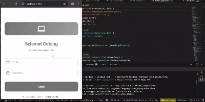

# Aplikasi Inventaris Komputer Fina

## Identitas

**Nama:** Fina Julianti
**NIM:** H1D023119
**Shift Baru:** E
**Shift Asal:** B

---

## Deskripsi Aplikasi

Aplikasi Inventaris Komputer Fina adalah aplikasi mobile yang dibangun menggunakan **Flutter** untuk mengelola inventaris perangkat komputer. Aplikasi ini memungkinkan pengguna untuk:

- Mendaftar dan login ke sistem
- Melihat daftar inventaris perangkat komputer
- Menambah inventaris baru
- Mengubah data inventaris yang sudah ada
- Menghapus data inventaris
- Logout dari sistem

---

## Video Demo Aplikasi

> **Demo Aplikasi:**



Dalam video demo, ditampilkan:
1. Proses registrasi akun baru
2. Proses login dengan akun yang sudah terdaftar
3. Halaman utama dengan daftar inventaris
4. Fitur menambah inventaris baru
5. Fitur mengubah data inventaris
6. Fitur menghapus inventaris
7. Proses logout dari aplikasi

---

## Spesifikasi API

### Base URL
```
http://localhost:3000
```

### 1. Authentication Endpoints

#### Register (POST)
- **Endpoint:** `/auth/register`
- **Deskripsi:** Mendaftarkan pengguna baru ke sistem
- **Request Body:**
  ```json
  {
    "nama": "string (nama lengkap pengguna)",
    "email": "string (email pengguna, harus unik)",
    "password": "string (password pengguna, minimum 6 karakter)"
  }
  ```
- **Response Success (200/201):**
  ```json
  {
    "success": true,
    "message": "Register berhasil"
  }
  ```
- **Response Error (400/500):**
  ```json
  {
    "success": false,
    "message": "Error message"
  }
  ```

#### Login (POST)
- **Endpoint:** `/auth/login`
- **Deskripsi:** Melakukan login pengguna ke sistem
- **Request Body:**
  ```json
  {
    "email": "string (email pengguna)",
    "password": "string (password pengguna)"
  }
  ```
- **Response Success (200):**
  ```json
  {
    "success": true,
    "token": "string (JWT token)",
    "message": "Login berhasil"
  }
  ```
- **Response Error:**
  ```json
  {
    "success": false,
    "message": "Error message"
  }
  ```

---

### 2. Inventaris Endpoints

#### Get All Inventaris (GET)
- **Endpoint:** `/inventaris`
- **Deskripsi:** Mengambil semua data inventaris
- **Response Success (200):**
  ```json
  [
    {
      "id": "integer (ID inventaris)",
      "nama": "string (nama perangkat)",
      "harga": "integer (harga perangkat dalam Rupiah)",
      "jumlah": "integer (jumlah unit)",
      "tanggal_masuk": "string (tanggal masuk, format: YYYY-MM-DD)"
    }
  ]
  ```

#### Create Inventaris (POST)
- **Endpoint:** `/inventaris`
- **Deskripsi:** Menambah data inventaris baru
- **Request Body:**
  ```json
  {
    "nama": "string (nama perangkat)",
    "harga": "integer (harga perangkat)",
    "jumlah": "integer (jumlah unit)",
    "tanggal_masuk": "string (tanggal masuk, format: YYYY-MM-DD)"
  }
  ```
- **Response Success (200/201):**
  ```json
  {
    "success": true,
    "message": "Inventaris berhasil ditambahkan"
  }
  ```

#### Update Inventaris (PUT)
- **Endpoint:** `/inventaris/{id}`
- **Deskripsi:** Mengubah data inventaris yang sudah ada
- **Path Parameter:**
  - `id` - ID inventaris yang akan diubah
- **Request Body:**
  ```json
  {
    "nama": "string (nama perangkat)",
    "harga": "integer (harga perangkat)",
    "jumlah": "integer (jumlah unit)",
    "tanggal_masuk": "string (tanggal masuk, format: YYYY-MM-DD)"
  }
  ```
- **Response Success (200/201):**
  ```json
  {
    "success": true,
    "message": "Inventaris berhasil diperbarui"
  }
  ```

#### Delete Inventaris (DELETE)
- **Endpoint:** `/inventaris/{id}`
- **Deskripsi:** Menghapus data inventaris
- **Path Parameter:**
  - `id` - ID inventaris yang akan dihapus
- **Response Success (200):**
  ```json
  {
    "success": true,
    "message": "Inventaris berhasil dihapus"
  }
  ```

---

## Penjelasan Struktur Kode dan Fungsi

### 1. **main.dart**

**Fungsi Utama:**
```dart
void main() {
  runApp(const MyApp());
}
```
- Merupakan entry point aplikasi Flutter
- Menjalankan aplikasi dengan widget `MyApp` sebagai root

**Class MyApp (StatelessWidget):**
```dart
class MyApp extends StatelessWidget
```
- Widget root aplikasi yang bersifat tidak berubah (stateless)
- Mengkonfigurasi tema aplikasi dengan Material Design 3
- Mengatur warna primer (#EC407A), font (Poppins), dan styling UI
- Menentukan halaman awal aplikasi adalah `LoginPage`

---

### 2. **lib/pages/login_page.dart**

#### Class `LoginPage` (StatefulWidget)
- Halaman login dengan state yang dapat berubah
- Merupakan entry point aplikasi sebelum masuk ke homepage

#### Controller & State:
```dart
final emailC = TextEditingController();  // Controller untuk input email
final pwC = TextEditingController();      // Controller untuk input password
bool loading = false;                     // Status loading saat proses login
```

#### Fungsi `login()` - Proses Login
```dart
login() async
```
- **Deskripsi:** Fungsi untuk melakukan proses autentikasi pengguna
- **Langkah-langkah:**
  1. Validasi input email dan password (tidak boleh kosong)
  2. Set state `loading = true` untuk menampilkan progress indicator
  3. Memanggil `AuthService.login()` dengan email dan password
  4. Set state `loading = false` setelah respons diterima
  5. Jika login berhasil, tampilkan snackbar success dan arahkan ke `HomePage`
  6. Jika login gagal, tampilkan snackbar dengan pesan error

#### Fungsi `_showSnackBar()` - Tampilkan Notifikasi
```dart
void _showSnackBar(String message, {bool isSuccess = false})
```
- **Deskripsi:** Menampilkan notifikasi floating snackbar kepada pengguna
- **Parameter:**
  - `message`: Pesan yang akan ditampilkan
  - `isSuccess`: Flag untuk menentukan warna (hijau untuk success, merah untuk error)
- **Fitur:**
  - Menggunakan `SnackBarBehavior.floating` untuk tampilan floating
  - Border radius untuk style modern
  - Margin 16px dari tepi layar

#### Widget Build
- TextField untuk input email (dengan icon email dan keyboard type emailAddress)
- TextField untuk input password (dengan obscureText untuk hide password)
- ElevatedButton untuk tombol Login (disabled saat loading)
- TextButton untuk navigasi ke halaman Register

---

### 3. **lib/pages/register_page.dart**

#### Class `RegisterPage` (StatefulWidget)
- Halaman pendaftaran akun baru

#### Controller & State:
```dart
final namaC = TextEditingController();      // Controller untuk input nama
final emailC = TextEditingController();     // Controller untuk input email
final pwC = TextEditingController();        // Controller untuk input password
bool loading = false;                       // Status loading saat proses register
```

#### Fungsi `register()` - Proses Registrasi
```dart
register() async
```
- **Deskripsi:** Fungsi untuk mendaftarkan akun pengguna baru
- **Langkah-langkah:**
  1. Validasi bahwa semua field (nama, email, password) terisi
  2. Set state `loading = true`
  3. Memanggil `AuthService.register()` dengan nama, email, dan password
  4. Set state `loading = false` setelah respons diterima
  5. Jika berhasil, tampilkan success message dan arahkan ke `LoginPage`
  6. Jika gagal, tampilkan error message

#### Fungsi `_showSnackBar()` - Tampilkan Notifikasi
- Sama dengan fungsi di `LoginPage` untuk menampilkan notifikasi

#### Widget Build
- TextField untuk input nama lengkap
- TextField untuk input email
- TextField untuk input password dengan obscureText
- ElevatedButton untuk tombol Daftar
- TextButton untuk kembali ke login

---

### 4. **lib/pages/home_page.dart**

#### Class `HomePage` (StatefulWidget)
- Halaman utama aplikasi yang menampilkan daftar inventaris
- Memiliki FAB (Floating Action Button) untuk menambah inventaris baru

#### State & Future:
```dart
late Future<Map<String, dynamic>> futureInventaris;  // Future untuk fetch data inventaris
```

#### Lifecycle & Data Loading:
```dart
@override
void initState() {
  super.initState();
  _loadInventaris();
}

void _loadInventaris() {
  futureInventaris = InventarisService.getAll();
}
```
- `initState()` dipanggil saat widget pertama kali dirender
- `_loadInventaris()` memanggil service untuk mengambil semua data inventaris

#### Fungsi `_showSnackBar()` - Tampilkan Notifikasi
- Sama dengan fungsi di login page dan register page

#### Fungsi `_deleteConfirmation()` - Dialog Konfirmasi Hapus
```dart
void _deleteConfirmation(int id, String nama)
```
- **Deskripsi:** Menampilkan dialog konfirmasi sebelum menghapus inventaris
- **Parameter:**
  - `id`: ID inventaris yang akan dihapus
  - `nama`: Nama inventaris untuk ditampilkan di dialog
- **Alur:**
  1. Tampilkan AlertDialog dengan pertanyaan konfirmasi
  2. Jika user klik "Hapus", panggil `InventarisService.deleteItem()`
  3. Jika sukses, reload data inventaris dan tampilkan success message
  4. Jika gagal, tampilkan error message

#### Fungsi `_formatCurrency()` - Format Harga
```dart
String _formatCurrency(int value)
```
- **Deskripsi:** Mengformat angka harga menjadi format Rupiah dengan separator
- **Contoh:** 1000000 → "Rp 1.000.000"
- **Metode:** Menggunakan RegExp untuk insert titik setiap 3 digit

#### FutureBuilder Widget
- Menampilkan `CircularProgressIndicator` saat loading
- Menampilkan error message jika ada error
- Menampilkan "Tidak ada data" jika list kosong
- Menampilkan ListView dengan data inventaris jika berhasil

#### ListTile untuk Setiap Item Inventaris
Menampilkan:
- Icon komputer
- Nama inventaris (title)
- Harga, jumlah, dan tanggal masuk (subtitle)
- PopupMenuButton dengan opsi Edit dan Hapus

#### Floating Action Button (FAB)
```dart
FloatingActionButton(
  onPressed: () async {
    final result = await Navigator.push(
      context,
      MaterialPageRoute(builder: (_) => const AddPage()),
    );
    if (result == true) {
      _loadInventaris();
      setState(() {});
      _showSnackBar("Inventaris berhasil ditambahkan", isSuccess: true);
    }
  },
  backgroundColor: const Color(0xFFEC407A),
  child: const Icon(Icons.add, color: Colors.white),
)
```
- **Deskripsi:** Tombol untuk navigasi ke halaman tambah inventaris
- **Alur:**
  1. Navigasi ke `AddPage`
  2. Menunggu hasil dari `AddPage`
  3. Jika result == true (berhasil menambah), reload data dan tampilkan success message
  4. Update UI dengan `setState()`

#### AppBar dengan Logout
- Menampilkan judul "Inventaris Komputer"
- IconButton untuk logout dengan konfirmasi dialog
- Dialog menanyakan apakah user yakin ingin logout
- Jika dikonfirmasi, arahkan ke `LoginPage`

---

### 5. **lib/pages/add_page.dart**

#### Class `AddPage` (StatefulWidget)
- Halaman untuk menambah data inventaris baru

#### Controllers:
```dart
final namaC = TextEditingController();      // Controller untuk nama
final hargaC = TextEditingController();     // Controller untuk harga
final jumlahC = TextEditingController();    // Controller untuk jumlah
final tanggalC = TextEditingController();   // Controller untuk tanggal
bool loading = false;                       // Status loading
```

#### Fungsi `_showSnackBar()` - Tampilkan Notifikasi
- Sama seperti di halaman lainnya

#### Fungsi `_selectDate()` - Pilih Tanggal
```dart
Future<void> _selectDate() async
```
- **Deskripsi:** Menampilkan DatePicker untuk memilih tanggal masuk inventaris
- **Alur:**
  1. Tampilkan `showDatePicker()` dengan initial date = hari ini
  2. First date = tahun 2000
  3. Last date = hari ini (tidak bisa pilih tanggal masa depan)
  4. Format tanggal yang dipilih ke format YYYY-MM-DD dan set ke `tanggalC`

#### Fungsi `addInventaris()` - Tambah Data Inventaris
```dart
addInventaris() async
```
- **Deskripsi:** Menambah data inventaris baru ke database
- **Langkah-langkah:**
  1. Validasi semua field tidak boleh kosong
  2. Set `loading = true`
  3. Parse input (harga dan jumlah konversi ke int)
  4. Panggil `InventarisService.create()` dengan data yang diinput
  5. Set `loading = false`
  6. Jika sukses, pop halaman dengan result = true
  7. Jika gagal, tampilkan error message

#### Widget Build
- TextField untuk nama inventaris (dengan contoh "Monitor, Keyboard")
- TextField untuk harga (numeric keyboard)
- TextField untuk jumlah (numeric keyboard)
- TextField untuk tanggal dengan DatePicker
- ElevatedButton "Simpan Inventaris"
- OutlinedButton "Batal" untuk kembali

---

### 6. **lib/pages/edit_page.dart**

#### Class `EditPage` (StatefulWidget)
- Halaman untuk mengubah data inventaris yang sudah ada
- Menerima parameter `inventaris` dari `HomePage`

#### Constructor:
```dart
const EditPage({required this.inventaris})
```
- Menerima object `Inventaris` untuk ditampilkan dan diedit

#### Controllers (Pre-filled):
- Controllers diisi dengan data inventaris yang ada saat widget dibuat
- Data ditampilkan di TextFields sehingga user dapat langsung mengedit

#### Fungsi `_selectDate()` - Pilih Tanggal
- Sama dengan fungsi di `AddPage`

#### Fungsi `updateInventaris()` - Update Data
```dart
updateInventaris() async
```
- **Deskripsi:** Mengubah data inventaris yang sudah ada
- **Alur:**
  1. Validasi semua field tidak boleh kosong
  2. Set `loading = true`
  3. Panggil `InventarisService.update()` dengan ID inventaris dan data baru
  4. Set `loading = false`
  5. Jika sukses, pop halaman dengan result = true
  6. Jika gagal, tampilkan error message

#### Widget Build
- Sama dengan `AddPage` namun untuk update
- AppBar judul "Edit Inventaris"
- TextField pre-filled dengan data lama
- ElevatedButton "Update Inventaris"

---

### 7. **lib/models/inventaris.dart**

#### Class `Inventaris`
- Model data untuk merepresentasikan satu item inventaris

#### Properties:
```dart
final int id;                    // ID unik inventaris dari database
final String nama;               // Nama perangkat (contoh: Monitor, Keyboard)
final int harga;                 // Harga perangkat dalam Rupiah
final int jumlah;                // Jumlah unit yang dimiliki
final String tanggalMasuk;       // Tanggal perangkat masuk (format YYYY-MM-DD)
```

#### Constructor:
```dart
Inventaris({
  required this.id,
  required this.nama,
  required this.harga,
  required this.jumlah,
  required this.tanggalMasuk,
});
```
- Constructor dengan semua property sebagai required parameter

#### Factory Constructor - `fromJson()`:
```dart
factory Inventaris.fromJson(Map<String, dynamic> json)
```
- **Deskripsi:** Membuat object Inventaris dari JSON response API
- **Fungsi:** Parse JSON response dari backend dan convert ke object Inventaris
- **Contoh Penggunaan:**
  ```dart
  Map<String, dynamic> jsonData = {
    'id': 1,
    'nama': 'Monitor LG 24 inch',
    'harga': 2500000,
    'jumlah': 5,
    'tanggal_masuk': '2024-01-15'
  };
  Inventaris item = Inventaris.fromJson(jsonData);
  ```

---

### 8. **lib/services/auth_service.dart**

#### Class `AuthService`
- Service untuk menangani semua operasi autentikasi
- Menggunakan HTTP client untuk komunikasi dengan backend

#### Constant:
```dart
static const baseUrl = "http://localhost:3000";
```
- URL base backend API yang digunakan untuk semua request

#### Static Method `register()` - Registrasi Pengguna
```dart
static Future<Map<String, dynamic>> register(String nama, String email, String password) async
```
- **Deskripsi:** Mengirim request registrasi ke backend
- **Parameter:**
  - `nama`: Nama lengkap pengguna
  - `email`: Email pengguna (harus unik)
  - `password`: Password pengguna
- **Return Value:** Map dengan key:
  - `success`: boolean (true jika berhasil)
  - `message`: string (pesan respons)
- **Alur:**
  1. Membuat POST request ke `/auth/register`
  2. Set Content-Type header ke application/json
  3. Encode parameter ke JSON
  4. Timeout 10 detik jika tidak ada respons
  5. Parse respons dan return map dengan success dan message
  6. Jika ada error, catch dan return error message

#### Static Method `login()` - Login Pengguna
```dart
static Future<Map<String, dynamic>> login(String email, String password) async
```
- **Deskripsi:** Mengirim request login ke backend
- **Parameter:**
  - `email`: Email pengguna
  - `password`: Password pengguna
- **Return Value:** Map dengan key:
  - `success`: boolean
  - `token`: string (JWT token dari backend, jika login berhasil)
  - `message`: string
- **Alur:**
  1. Membuat POST request ke `/auth/login`
  2. Set Content-Type header
  3. Encode email dan password ke JSON
  4. Tunggu respons dengan timeout 10 detik
  5. Jika status 200, extract token dari respons
  6. Return map dengan token dan message
  7. Jika status bukan 200, parse error message dan return
  8. Catch error dan return error message

---

### 9. **lib/services/inventaris_service.dart**

#### Class `InventarisService`
- Service untuk menangani semua operasi CRUD inventaris
- Menggunakan HTTP client untuk komunikasi dengan backend

#### Constant:
```dart
static const baseUrl = "http://localhost:3000";
```

#### Static Method `getAll()` - Ambil Semua Inventaris
```dart
static Future<Map<String, dynamic>> getAll() async
```
- **Deskripsi:** Mengambil daftar semua inventaris dari backend
- **Return Value:** Map dengan key:
  - `success`: boolean
  - `data`: List<Inventaris> (list kosong jika gagal)
- **Alur:**
  1. Membuat GET request ke `/inventaris`
  2. Parse JSON response menjadi List
  3. Convert setiap item ke object Inventaris menggunakan `fromJson()`
  4. Return map dengan success = true dan data = list items
  5. Jika gagal atau error, return map dengan success = false dan data = []

#### Static Method `create()` - Tambah Inventaris Baru
```dart
static Future<Map<String, dynamic>> create(String nama, int harga, int jumlah, String tanggal) async
```
- **Deskripsi:** Menambah data inventaris baru ke database
- **Parameter:**
  - `nama`: Nama perangkat
  - `harga`: Harga perangkat (integer dalam Rupiah)
  - `jumlah`: Jumlah unit
  - `tanggal`: Tanggal masuk (format: YYYY-MM-DD)
- **Return Value:** Map dengan key:
  - `success`: boolean
  - `message`: string
- **Alur:**
  1. Membuat POST request ke `/inventaris`
  2. Set Content-Type header
  3. Encode data ke JSON
  4. Tunggu respons dengan timeout 10 detik
  5. Jika status 200 atau 201, return success = true
  6. Jika status lain, return success = false
  7. Catch error dan return error message

#### Static Method `update()` - Update Inventaris
```dart
static Future<Map<String, dynamic>> update(int id, String nama, int harga, int jumlah, String tanggal) async
```
- **Deskripsi:** Mengubah data inventaris yang sudah ada
- **Parameter:**
  - `id`: ID inventaris yang akan diubah
  - `nama`: Nama perangkat (baru)
  - `harga`: Harga perangkat (baru)
  - `jumlah`: Jumlah unit (baru)
  - `tanggal`: Tanggal masuk (baru)
- **Return Value:** Map dengan key:
  - `success`: boolean
  - `message`: string
- **Alur:**
  1. Membuat PUT request ke `/inventaris/{id}`
  2. Embed ID di URL path
  3. Set Content-Type header
  4. Encode data baru ke JSON
  5. Tunggu respons dengan timeout 10 detik
  6. Jika status 200 atau 201, return success = true
  7. Jika status lain, return success = false
  8. Catch error dan return error message

#### Static Method `deleteItem()` - Hapus Inventaris
```dart
static Future<Map<String, dynamic>> deleteItem(int id) async
```
- **Deskripsi:** Menghapus data inventaris dari database
- **Parameter:**
  - `id`: ID inventaris yang akan dihapus
- **Return Value:** Map dengan key:
  - `success`: boolean
  - `message`: string
- **Alur:**
  1. Membuat DELETE request ke `/inventaris/{id}`
  2. Embed ID di URL path
  3. Tunggu respons dengan timeout 10 detik
  4. Jika status 200, return success = true
  5. Jika status lain, return success = false
  6. Catch error dan return error message

---

## Dependencies

Aplikasi ini menggunakan beberapa dependency utama:

| Package | Versi | Fungsi |
|---------|-------|--------|
| `flutter` | SDK | Framework untuk membangun UI aplikasi |
| `http` | ^1.1.0 | HTTP client untuk komunikasi dengan API backend |
| `cupertino_icons` | ^1.0.8 | Icon library untuk iOS style icons |
| `flutter_lints` | ^5.0.0 | Lint rules untuk code quality (dev dependency) |

---

## Teknologi yang Digunakan

- **Framework:** Flutter
- **Language:** Dart 3.9.2+
- **HTTP Client:** package:http
- **API:** RESTful API dengan Node.js/Express (backend)
- **Database:** MySQL/PostgreSQL (backend)

---

## Cara Menjalankan Aplikasi

1. **Setup Backend:**
   - Pastikan backend server berjalan di `http://localhost:3000`
   - Jalankan migrasi database jika diperlukan

2. **Setup Flutter Environment:**
   ```bash
   flutter pub get
   ```

3. **Run Aplikasi:**
   ```bash
   flutter run
   ```

4. **Build APK (Android):**
   ```bash
   flutter build apk --release
   ```

5. **Build for iOS:**
   ```bash
   flutter build ios --release
   ```

---

## Fitur Aplikasi

✅ **Autentikasi:**
- Registrasi akun baru
- Login dengan email dan password
- Logout dari sistem

✅ **Manajemen Inventaris:**
- Melihat daftar semua inventaris
- Menambah inventaris baru
- Mengubah data inventaris
- Menghapus inventaris dengan konfirmasi
- Format harga dengan separator Rupiah

✅ **User Experience:**
- Loading indicator saat proses network request
- Error handling dengan pesan informatif
- Snackbar notifikasi untuk setiap aksi
- Date picker untuk input tanggal
- Validasi input di semua form

---

## Struktur Folder

```
lib/
├── main.dart                 # Entry point aplikasi
├── models/
│   └── inventaris.dart       # Model data Inventaris
├── pages/
│   ├── login_page.dart       # Halaman login
│   ├── register_page.dart    # Halaman registrasi
│   ├── home_page.dart        # Halaman utama (daftar inventaris)
│   ├── add_page.dart         # Halaman tambah inventaris
│   └── edit_page.dart        # Halaman edit inventaris
└── services/
    ├── auth_service.dart     # Service autentikasi
    └── inventaris_service.dart # Service inventaris CRUD
```

---

## Catatan Developer

- Aplikasi menggunakan font custom **Poppins** untuk semua teks
- Warna primary aplikasi adalah **#757575** (abu-abu medium) sesuai dengan ketentuan yang diwajibkan
- Warna sekunder untuk gradient adalah **#9E9E9E** (abu-abu terang)
- Semua HTTP request memiliki timeout 10 detik
- Validasi input dilakukan di client-side sebelum mengirim ke API
- State management menggunakan `StatefulWidget` dan `setState()`

---

*Dokumentasi ini dibuat pada tanggal 6 Desember 2025*
